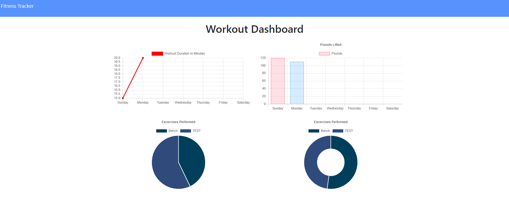

# Employee Management System

Here is the heroku link

<!-- #Merry Chritmas And  Happy New Year!! -->

## Author information
  GitHub: https://github.com/GrandBearSleepy

  Email-address: Hengquan.Li@outlook.com

  LinkedIn: linkedin.com/in/hengquan-li-60a7431b9